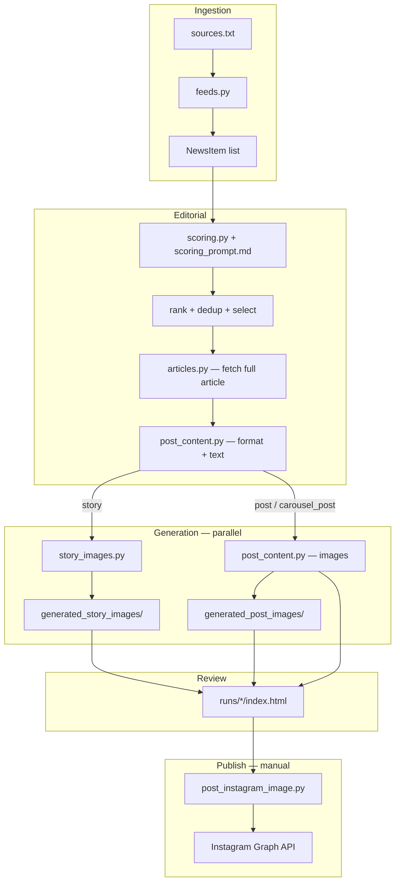

# RoozVan — Project Goal & Architecture

RoozVan (روز وَن) is an automated editorial pipeline that reads recent news from Vancouver/BC sources, picks stories relevant to the Iranian diaspora, and generates Instagram-ready content in Farsi — images, captions, and carousel slide plans.

The end-to-end flow:

```text
sources → extract → score → rank → dedup → select → enrich article → pick format → generate content/images → review → publish
```

---

## Goal

**Audience:** Iranian diaspora and Persian-speaking immigrants living in Metro Vancouver, BC.

**Editorial promise:** Not a Persian translation of English news. RoozVan turns local information into useful Farsi explanations with Vancouver context, clear takeaways, and practical next steps.

**North star:** *"My smart Persian friend in Vancouver who reads the news for me and explains what matters."*

Every piece of content should answer at least one of:

1. What happened?
2. Why does it matter to Iranians in Vancouver?
3. Who is affected?
4. What should people do next?
5. When/where does this apply?

See `prompts/_content_strategy.md` for the full editorial strategy (voice, format rules, caption templates, quality checklist).

---

## Instagram Formats

The pipeline produces three publishable formats. An LLM chooses the best one per story after scoring.

| Format | `format_selected` | Aspect ratio | Image text | Caption |
|--------|-------------------|--------------|------------|---------|
| **Story** | `story` | 9:16 | Composited separately (see below) | Optional; stories are often image-only |
| **Single post** | `post` | 4:5 | Headline + subline + category badge baked into image | Full Farsi caption with bullet points |
| **Carousel** | `carousel_post` | 4:5 per slide | Headline + body per slide | Carousel caption + swipe CTA |

### When to use each format

| Signal | Typical format |
|--------|----------------|
| Urgent, simple, expires in ~48h | `story` |
| Useful but straightforward, grid-worthy | `post` |
| Complex, saveable, multi-step (immigration, taxes, housing) | `carousel_post` |

Format selection happens in the same LLM call as caption/slide text generation, driven by `prompts/instagram_content_generation.md` and editorial scores (`actionability`, `practical_usefulness`, `share_save_potential`, etc.).

---

## Architecture Overview



Core Python package: `roozvan/`

| Module | Role |
|--------|------|
| `feeds.py` | Read RSS/Atom URLs from `sources.txt`, parse into `NewsItem` |
| `scoring.py` | LLM editorial scoring, ranking boosts, dedup keys |
| `articles.py` | Fetch article HTML, extract readable text |
| `story_images.py` | Generate 9:16 story backgrounds |
| `post_content.py` | Unified format + caption/slide text; 4:5 post/carousel images |
| `logo_overlay.py` | Apply RoozVan logo to bottom-left of generated images |
| `instagram.py` | Publish to Instagram via Graph API (+ optional R2 upload) |
| `pipeline.py` | Wire stages together with `PipelineConfig` |
| `models.py` | `NewsItem`, `ScoredItem`, `PostDraft` |

Entry points:

| Script | Purpose |
|--------|---------|
| `run_pipeline.py` | Run full pipeline, write debug dump + HTML preview |
| `generate_selected_images.py` | Generate images after HTML review (second pass) |
| `post_instagram_image.py` | Publish a post, story, or carousel to Instagram |

---

## Pipeline Stages

`build_default_pipeline()` in `roozvan/pipeline.py` runs these stages in order:

### 1. Recent news extraction (`feeds.py`)

- Reads feed URLs from `sources.txt` (one per line; `#` comments ignored).
- Supports HTTP(S) feeds and local XML files.
- Extracts: title, description, date, article URL, image URL, source URL.
- Drops items with a parseable date older than 2 days; items without a parseable date are kept.
- Output: `list[NewsItem]`.

### 2. Editorial scoring (`scoring.py`)

- Sends each item to an LLM with `scoring_prompt.md`.
- Scores 0–5 on: local relevance, practical usefulness, immigrant relevance, urgency, share/save potential, trustworthiness, actionability, originality.
- Assigns a category (`immigration`, `housing`, `transit`, `community_event`, etc.).
- Produces `persian_angle` (how to frame the story for the audience) and `reason_en`.
- Applies programmatic boosts: recency, feel-good local stories, evergreen utility keywords.
- Output: `list[ScoredItem]` with `evaluation` dict and `overall_score`.

**Default model:** `openrouter/owl-alpha` via `openrouter_client.py`.

### 3. Rank (`scoring.py`)

- Sorts by `overall_score` descending.

### 4. Dedup (`pipeline.py`)

- Deduplicates by article URL, or title+date fallback.

### 5. Select (`pipeline.py`)

- Keeps items with `overall_score >= minimum_score` (default 12).
- Respects `selection_gate_passed` from scoring.
- Stops at `selection_limit` (default 20).

### 6. Article extraction (`articles.py`)

- Fetches full article HTML for selected items only.
- Extracts readable text (CBC-aware parser + generic fallback).
- Sets `article_content` and `article_readable_without_js`.
- Enrichment happens here so scoring stays fast on RSS snippets alone.

### 7. Visual content generation (`VisualContentGenerationStage`)

1. **Unified text** — `generate_instagram_content_for_scored_items()` calls `prompts/instagram_content_generation.md` once per item with strict JSON schema. The model returns `format` (`post` / `story` / `carousel_post`) plus caption, overlay text, and carousel slides when applicable.

2. **Images** (parallel threads when enabled):
   - **Stories** → `generate_story_images_for_scored_items()` when `generate_story_images=True`
   - **Posts & carousels** → `generate_post_images_for_scored_items()` when `generate_post_images=True` and text was skipped

Default pipeline run is **text-first for speed**: format + captions/slides are generated, images are skipped unless flags are set.

### 8. Draft placeholders

- Wraps selected items in `PostDraft` objects for the debug dump.

---

## How Each Format Is Generated

### Story

**Content:** Stories are designed as quick, time-sensitive updates. The main pipeline does not generate a separate story caption by default — the visual carries the message once text is overlaid.

**Image (two-step design):**

1. **Background generation** (`prompts/story_image_generation.md`)
   - Gemini (default) or OpenRouter image model.
   - 9:16 realistic editorial photo **without any text**.
   - Top 38% reserved as clean negative space for Farsi overlay.
   - Bottom-left corner kept low-detail for logo.
   - Inputs: `{{TITLE}}`, `{{DESCRIPTION}}`, `{{ARTICLE}}`.

2. **Farsi text overlay** (currently in `experiments/farsi_story_overlay.py`, not wired into the main pipeline)
   - Composites category label, headline, and body in Vazirmatn font.
   - Category labels mapped from scoring `category`.

3. **Logo** (`logo_overlay.py`)
   - RoozVan logo applied bottom-left with adaptive backing.

**Output:** `generated_story_images/story-{index}-{slug}.{jpg|png}` + `.response_summary.json`

### Single post

**Content generation** (`post_content.py` + `prompts/post_caption_generation.md`):

1. LLM returns structured JSON:
   - `caption_fa` — Instagram caption (3–5 bullet points, hashtags)
   - `image_headline_fa`, `image_subline_fa`, `category_label_fa` — short text for the image
   - `short_alt_text_fa` — accessibility text

2. Caption normalizer splits dense paragraphs into emoji bullets (`📌`, `✅`, `🗓️`, etc.).

**Image generation** (`prompts/post_image_generation.md`, when `--generate-images`):

1. Builds `POST_CONTEXT` JSON (title, article, persian_angle, category, image text fields).
2. Gemini/OpenRouter generates 4:5 image with Persian headline, subline, and category badge rendered natively.
3. Logo overlay applied.

**Output:**
- Caption → `NewsItem.post_caption_fa`
- Image → `generated_post_images/post-{index}-{slug}.{ext}`
- Metadata → `evaluation.post_caption`

### Carousel

**Content generation** (via unified `prompts/instagram_content_generation.md` when `format=carousel_post`):

1. LLM returns structured JSON:
   - `caption_fa` — feed caption
   - `slides[]` — 3–6 slides, each with `headline_fa`, `body_fa`, `category_label_fa`, `visual_direction`
   - Slide 1 gets the category badge; later slides leave `category_label_fa` empty.

2. Stored in `evaluation.carousel_post`.

**Image generation** (`prompts/carousel_image_background_generation.md`, when `--generate-images`):

1. One text-free background per slide, generated in parallel (up to 4 workers).
2. Each slide gets `CAROUSEL_CONTEXT` with headline, body, badge (slide 1 only), scene notes.
3. Persian text is composited locally over each background.
4. Logo on each final slide.

**Output:**
- Caption → `NewsItem.post_caption_fa`
- Slides metadata → `evaluation.carousel_post.slides`
- Images → `generated_post_images/carousel-{index}-{slide:02d}-{slug}.{ext}`
- Paths list → `NewsItem.carousel_image_paths`

---

## Image Generation Details

| Setting | Default | Notes |
|---------|---------|-------|
| Provider | `openrouter` (default) | Via OpenRouter chat completions with image modalities (`OPENROUTER_API_KEY`) |
| Alt provider | `gemini` | Direct Gemini API (`GEMINI_API_KEY`) — use `--story-image-provider gemini` |
| OpenRouter model | `google/gemini-3.1-flash-image-preview` | Default story/post/carousel image model |
| Gemini model | `gemini-3.1-flash-image-preview` | Direct API only |
| Story aspect ratio | 9:16 | |
| Post/carousel aspect ratio | 4:5 | |
| Image size | 1K | |
| Logo | `assets/logo.png` | Bottom-left, skip with `--skip-logo-overlay` |

Implementation lives in `roozvan/story_images.py` (shared Gemini/OpenRouter helpers used by `post_content.py` too).

---

## Review Workflow

The pipeline is designed for a **two-pass** workflow:

### Pass 1 — Fast text review (default)

```bash
python3 run_pipeline.py --dump-dir runs/live-debug
```

- Generates format + text for all selected items (post, story, carousel) in one LLM call each.
- Skips all images unless `--generate-images` / `--generate-story-images`.
- Writes debug artifacts to `runs/<name>/`:
  - `extracted.json`, `scored.json`, `ranked.json`, `deduped.json`, `selected.json`
  - `post_drafts.json`, `config.json`, `timing.json`
  - **`index.html`** — Instagram-style HTML preview (RTL, Farsi captions, image placeholders)

Open `runs/live-debug/index.html` in a browser to review candidates.

### Pass 2 — Generate images for approved items

```bash
python3 generate_selected_images.py --dump-dir runs/live-debug
```

- Reads `selected.json` from the dump.
- Generates post/carousel/story images based on `format_selected`.
- Carousel images require slide text from pass 1 (generated automatically with unified content).
- Updates `selected.json` and regenerates `index.html`.

Filter to specific items:

```bash
python3 generate_selected_images.py --dump-dir runs/live-debug --only-source-index 24
```

### Full generation in one run

```bash
python3 run_pipeline.py \
  --generate-images \
  --dump-dir runs/live-20260605
```

---

## Publishing

`post_instagram_image.py` publishes via the Instagram Graph API.

**Required env vars:** `IG_ACCESS_TOKEN` (or `INSTAGRAM_ACCESS_TOKEN`), `IG_USER_ID` (or `INSTAGRAM_USER_ID`).

**Local images** need a public URL. Options:

- Set `INSTAGRAM_PUBLIC_BASE_URL` to map local paths to public URLs.
- Use `--upload-r2` to temporarily upload to Cloudflare R2 (`roozvan/r2_storage.py`), publish, then delete.

Examples:

```bash
# Single feed post
python3 post_instagram_image.py \
  --image-path generated_post_images/post-24-slug.jpg \
  --caption-file runs/live-debug/caption.txt \
  --upload-r2

# Carousel
python3 post_instagram_image.py \
  --carousel \
  --image-paths generated_post_images/carousel-24-01-slug.jpg generated_post_images/carousel-24-02-slug.jpg \
  --caption "..." \
  --upload-r2

# Story
python3 post_instagram_image.py \
  --story \
  --image-path generated_story_images/story-24-slug.jpg \
  --upload-r2
```

---

## Prompt Files

| File | Used for |
|------|----------|
| `scoring_prompt.md` | Editorial scoring (all items) |
| `prompts/instagram_content_generation.md` | Format + caption/slide text (unified, JSON schema) |
| `prompts/story_image_generation.md` | 9:16 text-free story backgrounds |
| `prompts/post_image_generation.md` | 4:5 text-free single-post backgrounds |
| `prompts/post_image_background_generation.md` | Alternate/background-only single-post prompt |
| `prompts/post_caption_generation.md` | Legacy post-only caption prompt (control-panel experiments) |
| `prompts/carousel_content_generation.md` | Legacy carousel-only prompt (experiments) |
| `prompts/carousel_image_background_generation.md` | Per-slide carousel backgrounds |
| `prompts/_content_strategy.md` | Editorial strategy reference (not injected into pipeline) |

Prompts use placeholders like `{{POST_CONTEXT}}`, `{{CAROUSEL_CONTEXT}}`, `{{TITLE}}`, `{{SCORING_CONTEXT}}` replaced at runtime with JSON context.

---

## Data Model

### `NewsItem`

Raw and enriched article fields plus generated assets:

```python
title, description, date, url, image_url, source_url
article_content, article_readable_without_js
story_image_path, story_image_background_path
post_image_path, post_image_background_path
carousel_image_paths, carousel_image_background_paths
post_caption_fa
```

### `ScoredItem`

```python
source_index, item: NewsItem
evaluation: dict   # scores, category, persian_angle, post_caption, carousel_post, ...
overall_score: float
format_selected: "post" | "story" | "carousel_post" | None
```

### `PostDraft`

Wrapper around `ScoredItem` with optional `image_prompt_fa` and `caption_fa` for the debug dump.

---

## Configuration Reference

Key `PipelineConfig` flags (`roozvan/pipeline.py`):

| Flag | Default | Effect |
|------|---------|--------|
| `generate_post_content` | `True` | Unified format + caption/slide text |
| `generate_post_images` | `False` | Generate post/carousel images |
| `generate_story_images` | `False` | Generate story backgrounds |
| `minimum_score` | `12` | Selection threshold |
| `selection_limit` | `20` | Max selected items |
| `workers` | `16` | Parallel LLM requests for scoring and content generation |
| `apply_logo_overlay` | `True` | Logo on generated images |

**Env vars:**

| Variable | Purpose |
|----------|---------|
| `OPENROUTER_API_KEY` | LLM scoring and unified Instagram content |
| `OPENROUTER_KIMI_PROVIDER` | OpenRouter provider slug for Kimi text calls (default: `WandB`) |
| `GEMINI_API_KEY` | Direct Gemini image generation (optional; `--story-image-provider gemini`) |
| `IG_ACCESS_TOKEN` / `IG_USER_ID` | Instagram publishing |
| R2 credentials | Temporary image hosting for Instagram API |

---

## Experiments

The `experiments/` folder holds work-in-progress tooling not wired into the default pipeline:

| Script | Purpose |
|--------|---------|
| `farsi_story_overlay.py` | Composite Farsi text on text-free story backgrounds |
| `batch_flash_overlay_preview.py` | Batch story background + overlay preview |
| `generate_unified_content_preview.py` | Unified content preview experiments |

Story backgrounds are generated without text by design; overlay composition is the intended second step but lives in experiments today.

---

## Repository Layout

```text
RoozVan/
├── sources.txt              # RSS/Atom feed URLs
├── scoring_prompt.md        # Editorial scoring prompt
├── prompts/instagram_content_generation.md
├── prompts/                 # Image and caption generation prompts
├── roozvan/                 # Core Python package
├── run_pipeline.py          # Main entry point
├── generate_selected_images.py
├── post_instagram_image.py
├── openrouter_client.py     # OpenRouter API client
├── assets/logo.png          # Brand logo for overlay
├── generated_story_images/  # Story outputs (gitignored artifacts)
├── generated_post_images/   # Post/carousel outputs (gitignored artifacts)
├── runs/                    # Pipeline debug dumps + HTML preview
└── experiments/             # Overlay and preview experiments
```

---

## Typical Daily Flow

1. **Run pipeline** — `python3 run_pipeline.py --dump-dir runs/live-$(date +%Y%m%d)`
2. **Review** — open `runs/.../index.html`, pick 1–3 candidates
3. **Generate images** — `python3 generate_selected_images.py --dump-dir runs/... --only-source-index N`
4. **Re-review** — refresh `index.html` with images
5. **Publish** — `post_instagram_image.py` with caption file and `--upload-r2`
6. **Optional** — share feed post to Story manually in Instagram app
